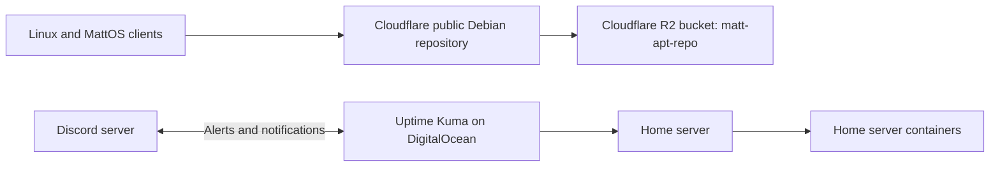

# Homelab Setup

This homelab is split across three roles: a Cloudflare-hosted Debian package repository, a DigitalOcean monitoring node, and a home server that runs the primary application containers.



## Cloudflare Debian Repository

The MattOS Debian APT repository is published through Cloudflare R2 and served publicly at:

```text
https://packages.mattsherfey.com
```

The repository manager is [../GenericScripts/ManageMattOSRepository.py](../GenericScripts/ManageMattOSRepository.py). Its default R2 bucket is `matt-apt-repo`; it publishes the `trixie` suite, `main` component, and `amd64` packages. The tool signs repository metadata with the `MattOS Repository Signing Key` stored in Bitwarden and obtains R2 credentials from the `MattOS R2 Repository Publisher` Bitwarden item.

Cloudflare R2 is the persistent package source of truth. The publication tool rebuilds the repository from the remote package set, uploads packages before indexes, uploads signed metadata last, and uses a short-lived remote lock to avoid concurrent publishers.

## DigitalOcean Monitoring Node

Uptime Kuma runs on a DigitalOcean droplet as the independent monitoring service. Keeping monitoring off the home server allows it to report when the home server or its services are unreachable.

The Uptime Kuma container is explicitly configured as:

| Setting | Value |
| --- | --- |
| Container name | `uptime-kuma` |
| Image | `louislam/uptime-kuma:latest` |
| Persistent data | `~/.uptime-kuma/data` |
| Default host port | `3002` |
| Container port | `3001` |
| Restart policy | `unless-stopped` |

The service is managed from `Tools/ServerManager.py` or directly with:

```bash
python3 src/containers/run_uptime_kuma.py
```

It retains the normal install/start behavior plus `--on`, `--off`, and `-D` lifecycle actions. Uptime Kuma communicates monitoring alerts and notifications to the Discord server. The Discord webhook and monitor definitions are managed in Uptime Kuma itself rather than stored in this repository.

## Home Server

The home server hosts the regular application workloads. `Tools/ContainerManager.py` is the main interactive entry point for the first five workloads; each also has a direct Python launcher under `src/containers/`.

### Standalone Containers

| Service | Container name | Default host port | Persistent data |
| --- | --- | ---: | --- |
| Homepage dashboard | `homepage` | `3001` | `~/.homepage-dashboard` |
| Portainer CE | `portainer` | `9443` HTTPS, `8000` Edge | `~/.portainer/data` |
| Ollama | `ollama` | `11434` | `~/.ollama-stack/ollama` |
| Open WebUI | `open-webui` | `3000` | `~/.ollama-stack/open-webui` |
| AUTOMATIC1111 Stable Diffusion WebUI | `automatic1111` | `7861` | `~/.automatic1111` |

Homepage requires an active Tailscale connection and rewrites configured loopback URLs to the active Tailscale IPv4 address. Portainer provides Docker administration. Ollama and Open WebUI form the local AI stack. AUTOMATIC1111 runs the Stable Diffusion WebUI and uses NVIDIA GPU passthrough when Docker and the host support it.

### Jellyfin Media Stack

The Jellyfin workload is a Compose stack rooted at `~/.jellyfin-stack`. Its services are:

| Service | Container name | Default host port | Role |
| --- | --- | ---: | --- |
| Jellyfin | `jellyfin` | `8096` | Media server |
| Radarr | `radarr` | `7878` | Movie library automation |
| Sonarr | `sonarr` | `8989` | Television library automation |
| Seerr | `seerr` | `5055` | Media request management |
| Jackett | `jackett` | `9117` | Indexer aggregation |
| qBittorrent | `qbittorrent` | `8080`, `6881` TCP/UDP | Download client |
| Gluetun | `gluetun` | Exposes qBittorrent ports | ProtonVPN network gateway and kill switch |
| FlareSolverr | `flaresolverr` | Shares Jackett network namespace | Browser-based challenge solving for Jackett |

qBittorrent uses Gluetun's network namespace, keeping torrent traffic inside the ProtonVPN tunnel. The other media services remain on the `jellyfin_stack_net` Docker network. Media, music, and download locations are selected during initial stack setup and stored in the stack configuration.

## Operational Boundaries

- Cloudflare hosts and serves the Debian package repository; it does not run the home-server application containers.
- The DigitalOcean droplet runs Uptime Kuma and relays monitoring events to Discord.
- The home server runs Homepage, Portainer, the Ollama/Open WebUI stack, AUTOMATIC1111, and the Jellyfin media stack.
- Uptime Kuma is deliberately outside the normal home-server Container Manager queue because its monitoring value depends on being independent from the services it monitors.